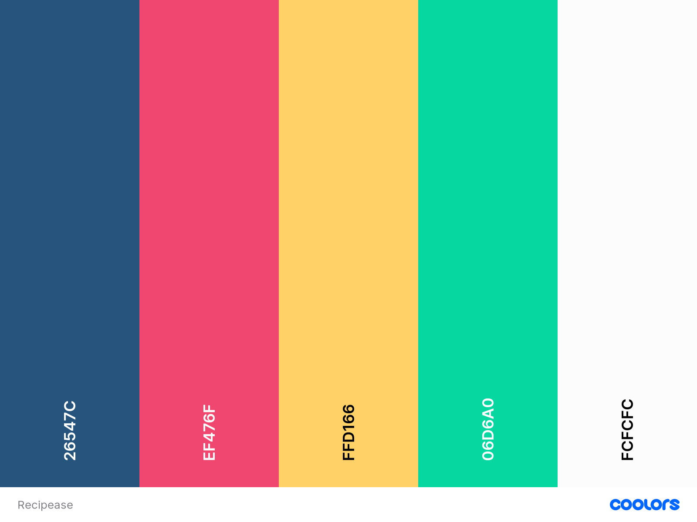

# Recipease 

## Code Institute Milestone Project 3

This website is created for educational purposes only.

    
    
The brief for this third Milestone project was to build a full-stack site that allows users to manage a common dataset about a particular domain. It is the third of four projects as part of the Full Stack Web Development Program at The Code Institute. 

## Table of Contents
1. [**Project overview**](#project-overview)
2. [**UX (User Experience)**](#ux-(user-experience))
3. [**User Stories and Features**](#project-overview)
4. [**Project overview**](#project-overview)

## Project Overview
The Recipease recipe website was created first and foremost as a way to fulfill the requirements of the CI project brief. One of the example projects for the project brief was a recipe website. I decided to go with an example project this time, because with my last two projects I learnt that I am able to spend a long time deciding on what to make and I didn't want to waste valueble time deciding while I could be actually building the site instead. I once again took inspiration from my own life to differentiate the website a little. This website focuses on users who have allergies in their families.
Recipease was built using [Python](https://www.python.org/), [Flask](https://flask.palletsprojects.com/en/1.1.x/) and [MongoDB Atlas](https://www.mongodb.com/), which is a document-based database for the storing and retrieving data.

[Click here to view the project live.](https://ms3-recipease.herokuapp.com/)

## UX (User Experience)

### Goals
The Recipease website is a web application where users are able to add and store their own recipes, as well as view recipes added by others. It is designed with users in mind who have multiple allergens in their family or friend circle. 

### User Stories

The user stories below are structured so that the various user stories are the numbered bullet points, and the solutions/features required to satisfy these needs are the lettered bullet points.

1. I heard of this website via word of mouth and want to see what it’s about.
2. I would like to find a recipe for dinner tonight. I am allergic to some things. 
3. I am looking for a one stop place to add, edit and view my own recipes.
4. I want to view recipes and know that I will never see recipes with my allergens in them. Sometimes I might want to see all recipes though, so I can adapt them myself.
5. I am throwing a dinner party and my friends have an assorted collection of allergies. I want to find a recipe for every course to satisfy all their requirements.
6. I like to easily share recipes with people. 
7. As a registered user, I would like to easily be able to favourite recipes and navigate to my favourites easily. 

### Site owner goals:
1. I want to create a customer base to target with occasional direct marketing and special offers. (If not necessarily by DM via email, then by showing special offers only to logged in users.
2. I want to promote certain cooking tools / recipe books via my website.

#### Stretch Goals
With time and resources allowing, other goals are to implement:
- Favourites. - Floating action buttons on the recipe cards and recipe that when clicked add to a FAVOURITES page.
- Shop Page - A business goal as a way of monetizing the site.
- Share button - This would be a button on the recipe page that linked to various social media

### Design

The [Materialize library](https://materializecss.com/) was used throughout in order to maintain a consistent and clean-looking site throughout the pages. This also had the benefit of allowing me to primarily focus in the back-end building. 

I looked at various other recipe websites for inspiration and decided on a page displaying small recipe cards that the user can scroll through as this is a standard format that looks good and is mobile-friendly. The recipe page itself (where ingredients and method is detailed) was inspired by the [BBC Food website](https://www.bbc.co.uk/food), as I liked their simple design, and I like to see the ingredients and method at the same time. Initially I had envisaged only having the ingredient and method sections stacked on top of each other instead of side by side on mobile, but when I started top put real recipes in instead of test ones, I realised that it was cluttered and not easiyl readable, so I changed to displaying the method secion underneath the ingredients at all times.

If no recipe image is uploaded by the user, an icon image is displayed based on the category of the dish, so there is an icon with croissant for the breakfast category, an icon with a hotdog for the snack category and so on.

Some other things that changed from initial design during the development were the way to filter allergens, and the toggle for hiding a registered user's allergens. 
As can be seen in the wireframe for the recipe page, I had initially designed a grid of allergens to filter. The idea was that they are greyed out, but change to a colour when clicked on to filter them out. These colours would of course correspond to the same allergens on the recipe card and recipe page. However, when I started using Materialize, I realised the dropdown select menu will be more familiar to users. I changed to this design rather than my novel design, as the website’s mission after all, is to make users feel at ease.
I had also designed it as such that a logged in user would never be presented with recipes containing their allergens, again with the aim of making them feel more at ease. Although users may feel more comfortable never seeing dishes with their allergens in, it felt wrong to take away that option of choice so I implemented the toggle switch.

#### Wireframes

I used Figma to put together some wireframes for the most important pages when designing the project and these were used as a guide rather than an exact template. Since I was using Materialize for efficiency, consistency and responsiveness, I left some of the design decisions with them, such as the log in and register pages. For these, I did some minor styling to match it to the rest of the site.

* [Home](/documents/wireframes/wf_home_page.png) 
* [Recipes](/documents/wireframes/wf_recipes_page.png) 
* [Add Recipe](/documents/wireframes/wf_add_recipe.png) 
* [Recipe Description](/documents/wireframes/wf_recipe_descr.png) 

#### Colour Palette

Allergens on for example restaurant menus, are often marked in different colours, [for example](https://www.dickinson.edu/images/Menu_Picture_for_Website.jpeg) This is something that people with allergies are used to seeing, and I wanted to keep this for my website. Since my last two projects used fairly muted colours I also wanted to be a bit more playful with bolder colours this time. 

I used the [coolors](https://coolors.co) website to help me choose complementary colours and choose the below scheme which made me think of summery surfy vibes. Perfect for a website which aims to make the users feel happy and comfortable. 

#### Typography

I used [Google fonts](https://fonts.google.com/) to embed fonts into my site by copying the code into the <head> of my html. 
I chose what I believe to be a casual but stylish font for the logo, which is displayed on all pages on the nav bar, and on the home page. This is the Pacifico font, which is in keeping with the colour scheme. I chose the easy to read Open Sans font throughout the site, which was complementary to the font I used for the name of the website. 

#### Imagery

Initially I had used black and white icons for the category pictures. Later on in the project, I came across the [flaticon website](http://www.flaticon.com) that provides coloured icons for free, and swapped to these as they match the rest of the site better and pull the whole thing together.

#### Database 

There were no specific relationships that need to be maintained between any of the aspects of the database components so a non-relational database is used. MongoDB is a popular, multipurpose and cloud-based database system that is easy to use with Flask and Python. 

The documents in the database do relate to each other in some ways however, and a simplified diagram of the schema is visible below. 

The four collections contained simple objects. The recipes object holds more data than the others, however, including an array for the allergens.

### Features

#### Existing Features

##### Consistent Features across all pages

- Always-visible navigation bar with the *Recipease* logo on the left (linking to index.html) and links to the sub-pages on the right. 
- On small screens the navigation bar changes to a hamburger button which brings up a left-hand navigation menu when clicked.
- A Profile dropdown in the navbar where unlogged users can login/register, and logged in users can navigate to registered-only features.
- Sticky footer with links to social media.

##### Home

- A simple but bright home page detailing briefly what the site is intended to do.
- Three sections advertising its main and differentiating features, with the intent to entice the user to continue on to use the features of the site.

##### Recipes

- The user is presented with an uncluttered page with eight small cards for the different categories, as well as a larger one at the top for all recipes.
- Upon clicking any of these cards, the user is taken through to a new page showing only recipe cards in that category. These are all the same size with the same size pictures. Four per row on large screens, two on small screens.  Only picture, name and allergens are shown at first.
- Upon clicking a card, more information relating to the recipe is shown, and with another click, the user is taken to the recipe page.
- If the user has linked to a picture when they added the recipe, this will be displayed on the card. If not, a default icon will be displayed that relates to the type of dish (cake, dinner, soup etc.).
- At the top of the page there is the multiple selection dropdown filter to exclude allergens. There are apply filter and clear filter buttons and a key that details the allergens as displayed on the recipe cards.
- Any allergens are displayed on the bottom of the card in a grid and are represented by a two-letter abreviation and a colour. A hover-over also shows the full allergen name.

##### Recipe page

- A picture (user-uploaded or default) is shown at the top of the page, with the vital information about the recipe is to the right of the picture, widely spaced and easy to scan. The allergens are displayed with the same colours as on the recipe cards.
- Ingredients and method are divided into two columns that stacked on top of each other on all screens.

##### My Recipes

- The user is presented with identical recipe cards as on the RECIPES page, but only the ones that they have added themselves.
- Below the cards there are EDIT and DELETE buttons. Clicking on DELETE will bring up a modal that asks the user if they definitely want to delete the recipe, or cancel the deletion. Clicking EDIT will redirect to the EDIT RECIPE page (see below).

##### Add Recipe / Edit Recipe

- The EDIT RECIPE page is identical to the ADD RECIPE one, but has all the information pre-selected and filled in.
- The ADD/EDIT pages are layed out in a similar structure as the Recipe page, with widely spaced out sections for the vital information, and then the sections to fill in ingredients and methods at the bottom of the screen. 
- At the bottom there are buttons to ADD/EDIT or CANCEL. 
- Input field validation:
    - Appropriate maxlength attributes in html for input fields.
    - Appropriate RegEx so only numeric characters can be input for 'servings' and 'time' fields.
    - Image field has url validator that validates if it is a url, but does not validate if it is active

##### Account

- In order to unclutter the nav bar, the navigation links to pages related to a user's account were consolidated into an expandable ACCOUNT button, containing the options to LOG IN and REGISTER.
- For the username registration, min- and max-length attributes are used, as well as a pattern attribute in order to ensure that users only use alphanumeric characters.

## Technology

#### Languages Used
- HTML5
- CSS3
- jQuery
- Python

#### Frameworks, Libraries & Programs Used

1. [MongoDB](https://www.mongodb.com/)
    - MongoDB is a document-based database where content of the website is stored, read, edited and deleted.
2. [Flask](https://flask.palletsprojects.com/en/1.1.x/)
    - Flask is a web application framework.
3. [Flask PyMongo] (https://flask-pymongo.readthedocs.io/en/latest/)
    - v  MongoDB support for Flask applications
4. [https://pymongo.readthedocs.io/en/stable/index.html](https://pymongo.readthedocs.io/en/stable/index.html)
    - PyMongo is a Python distribution containing tools for working with MongoDB, and is the recommended way to work with MongoDB from Python
5. [Werkzeug](https://palletsprojects.com/p/werkzeug/)
    - Flask wraps Werkzeug, using it to handle the details of WSGI while providing more structure and patterns for defining powerful applications.
6. [Jinja](https://palletsprojects.com/p/jinja/)
    - Jinja2 is a full-featured template engine for Python.
7. [BSON](https://www.mongodb.com/json-and-bson)
    - BSON is the binary encoding of JSON-like documents that MongoDB uses when storing documents in collections.
8. [Gitpod](https://www.gitpod.io/)
    - Gitpod was the environment in which the site was created, using the terminal to commit to Git and Push to GitHub.
9. [Github](https://github.com/)
    - Hosting for software development and version control using Git.
10. [Heroku](https://www.heroku.com/home)
    - Heroku is a cloud platform as a service supporting several programming languages.
11. [Materialize](https://materializecss.com/)
    - A modern responsive front-end framework based on Material Design.
12. [Google Fonts:](https://fonts.google.com/)
    - Google fonts were used to import the 'Montserrat' font into the style.css file which is used on all pages throughout the project.
13. [Font Awesome:](https://fontawesome.com/)
    - Font Awesome was used on all pages throughout the website to add icons for aesthetic and UX purposes.
14. [Figma](https://www.figma.com/) 
    - Figma was used to create wireframes and aid design and layout decisions.

## Testing

see seperate testing.md file

## Deployment and Cloning Repo

### Deployment to Heroku

1. Before deploying to Heroku, some files need to be set up within the IDE, Gitpod in this case.
2. The requirements.txt file, and the Procfile can be created within the terminal by typing `<pip3 freeze > requirements.txt>` and `<echo web: python app.py > Procfile>`, respectively, making sure to delete any blank lines that sometimes get created. 
3. Commit and push to the Github repo.
4. Log into Heroku and on the dashboard go to NEW > Create New App. 
5. Name the project and select the closest region.
6. Choose Github as the deployment method, and connect the relevant Github repo.
7. Next, go to Settings > Config Vars > Reveal Config Vars and set up the variables for the IP, PORT, SECRET_KEY, MONGO_URI and MONGODB_NAME. 
8. In the Deploy tab, turn on Automatic Deployment, and then click Deploy Branch to deploy the master and allow Heroku to build the app. Once complete, clicking View App will open it.

### Cloning this repo

1. At the top of this repository, click Clone or download.
2. In the Clone with HTTPs dropdown, copy the clone URL for the repository.
3. In your IDE terminal, change the current working directory to the location where you want to clone the repo.
4. Type `<git clone>`, paste the URL you copied in Step 2, and then press Enter.
5. In the terminal type `<pip3 install -r requirements.txt>` in order to install all required modules.
6. Set up an env.py file in the root directory, and set the variables for IP, PORT, SECRET_KEY, MONGU_URI and MONGODB_NAME as described above.
7. The web application can now be run by typing `<python3 app.py>` in the terminal.

## Credits

attributions:
    for add recipe tickboxes
    https://stackoverflow.com/questions/5799090/remove-whitespace-and-make-all-lowercase-in-a-string-for-python

    for m=Materialize dropdown validation workaround
    jquery code copied from Code Institute lesson Course  Mini Project | Putting It All Together  Adding A Task - Writing to the Database  Materialize Form Validation

